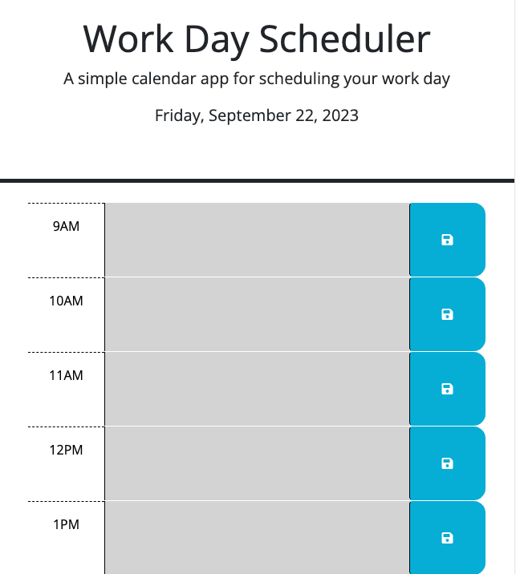
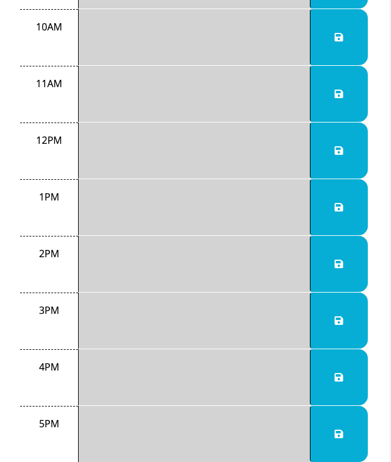
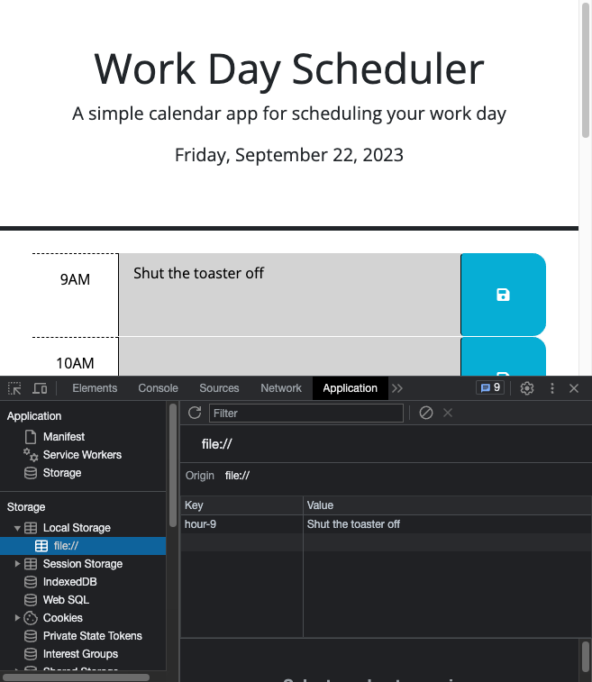

# work_day_planner

## In this application, I created a scheduler for a typical 9-5 work day. The user can input an appointment into one of the timeblocks. When they click the 'save' button, their appointment is saved to local storage. If they refresh the page, the appointment remains in the timeblock. The background colors of each timeblock also correspond to the current hour. Timeblocks that are in the past are displayed grey, the current timeblock is displayed red, and future timeblocks are displayed green. Also, the current date is displayed at the top of the application.

Link: <a href="https://coreyphillipsofficial.github.io/work_day_planner/">Javascript Quiz</a> 

## Installation

N/A

## Usage

The user visits the website, enters in appointments to the timeblocks, and clicks the corresponding 'save' button in order to save the appointment to their local storage.

## Credits

I receieved guidance on this application from my instructor, JD Tadlock in class, and my tutor, Cody Junier, gave me tips on how to complete certain tasks. I also referred to ChatGPT to help me figure out where my syntax was incorrect.

## License

Please refer to the LICENSE in the repo.